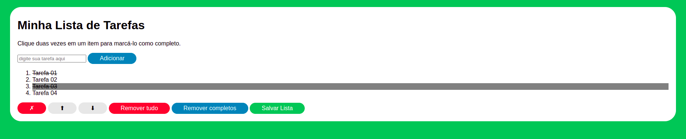

<h1 align="center">Project To Do List</h1>

<p align="center">✔️ Concluded</p>

## 💻 Instalando o projeto

Clone o repositório:

```
git clone git@github.com:lramos33/project-to-do-list.git
```

Acesse a pasta do repositório

```
cd project-to-do-list
```

Execute o arquivo index.html

## 🚀 Habilidades

- Manipular CSS;
- Manipular Javascript.

## 🔧 Desenvolvimento

Neste projeto foi desenvolvido uma aplicação de lista de tarefas usando `HTML`, `CSS` e `JavaScript`.



## 📝 Requisitos do projeto

- [x] 1.  Adicione à sua lista o título "Minha Lista de Tarefas" em uma tag;

- [x] 2. Adicione abaixo do título um pequeno e discreto parágrafo com id="funcionamento" e com o texto "Clique duas vezes em um item para marcá-lo como completo";

- [x] 3. Adicione um input com o id="texto-tarefa" onde a pessoa usuária poderá digitar o nome do item que deseja adicionar à lista;

- [x] 4. Adicione uma lista ordenada de tarefas com o id="lista-tarefas";

- [x] 5. Adicione um botão com id="criar-tarefa" e, ao clicar nesse botão, um novo item deverá ser criado ao final da lista e o texto do input deve ser limpo;

- [x] 6. Ordene os itens da lista de tarefas por ordem de criação;

- [x] 7. Clicar em um item da lista deve alterar a cor de fundo do item para cinza rgb(128,128,128);

- [x] 8. Não deve ser possível selecionar mais de um elemento da lista ao mesmo tempo;

- [x] 9. Clicar duas vezes em um item, faz com que ele seja riscado, indicando que foi completo. Deve ser possível desfazer essa ação clicando novamente duas vezes no item;

- [x] 10. Adicione um botão com id="apaga-tudo" que quando clicado deve apagar todos os itens da lista;

- [x] 11. Adicione um botão com id="remover-finalizados" que quando clicado remove somente os elementos finalizados da sua lista.

##

<div align="center">
  
  
  
</div>
